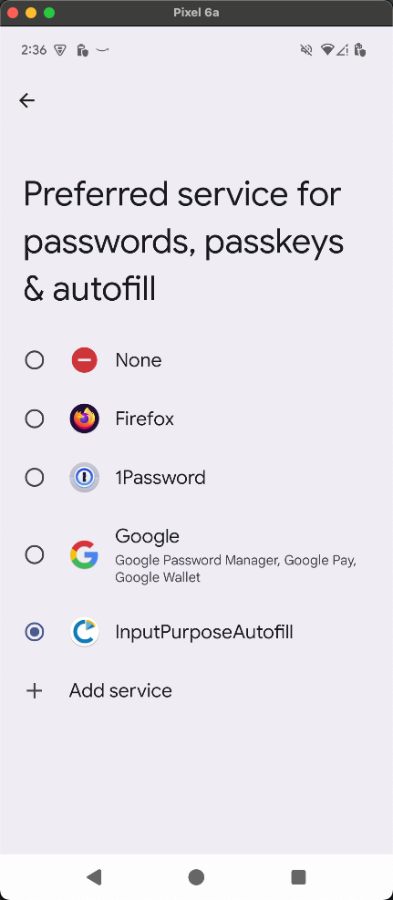
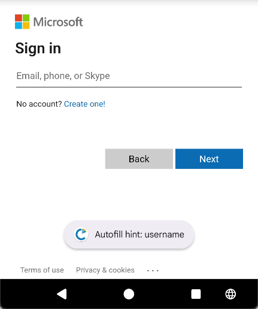

# Input Purpose Autofill

This is an app that exposes the Android AutoFill values for fields for testing accessibility guidelines for [1.3.5 Input Purpose](https://www.w3.org/WAI/WCAG22/Understanding/identify-input-purpose.html). 

## Select a default autofill provider

Once installed, the app will appear in the app drawer under "Input Purpose Autofill". 
* After opening the app, it will provide a button that will take you to the system autofill settings. 
* Make sure the "Input Purpose AutoFill" app is selected as the provider. 

## Enabling Notification for the Autofill Service

In order to provide toast notificaitons, the app needs notification permissions. Keep in mind that the actual steps below may be different for your device, but they should be pretty close. 

* Open the Settings app
* Go to "Notifications"
* Go to "App Notifications"
* You may have to change the filter from "Most recent" to "All apps"
* Scroll down until you find "InputPurposeAutofill"
* Make sure the switch for notifications is turned on

## Exposing the AutoFill value

After the app is set at the Autofill provider, when you click on a field that is exposed to autofill services and it has an autofill value, a toast message will appear with the autofill value.

Autofill values should correspond with the Autofill values that are provided for Android. More information on autofill can be found at from Google's article on [optimizing apps for autofill](https://developer.android.com/identity/autofill/autofill-optimize). If a toast message does not pop up when a field is focused, then that field is not exposed to autofill services and would fail 1.3.5 Input Purpose. Keep in mind the autofill service doesn't always receive information every time a field is focused especially if there are multiple fields on a single screen. For proper testing, return to a previous screen and return the screen to be tested to reload the content, place focus on the field that you want to test, if the toast does not appear, the field is not exposed for autofill. 

## WebViews

WebViews are built differently and do not expose the autofill values in the expected way. Some WebView providers outside of Chrome may support autofill properly, but Chrome WebViews do not. 
